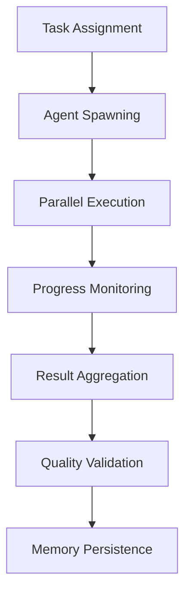

# Cursor Swarm vs Hive-Mind Directive

## Executive Summary

This document defines the operational modes for Cursor/Claude Flow agents working on the VIN Stressors Platform.

## Core Philosophy: Swarm Intelligence

**ALWAYS USE SWARM MODE** - Individual agents with collective intelligence, NOT hive-mind centralized control.

### Why Swarm Mode?

1. **Autonomy**: Each agent makes independent decisions
2. **Resilience**: No single point of failure
3. **Scalability**: Parallel execution without bottlenecks
4. **Innovation**: Diverse approaches to problem-solving

### Implementation Matrix

| Task Type | Mode | Strategy | Agents |
|-----------|------|----------|--------|
| Feature Development | Swarm | development | 3-5 |
| Bug Fixes | Swarm | debugging | 2-3 |
| Performance | Swarm | optimization | 4-6 |
| Documentation | Swarm | research | 2-4 |
| Testing | Swarm | testing | 3-5 |

### Required Outputs per Agent

Each swarm agent MUST produce:

```yaml
outputs:
  code:
    - implementation: required
    - tests: required
    - validation: required
  
  documentation:
    - inline_comments: required
    - api_docs: required
    - changelog: required
  
  traces:
    - execution_log: required
    - decision_rationale: required
    - performance_metrics: required
  
  memory:
    - session_state: required
    - learned_patterns: required
    - optimization_hints: required
```

### Swarm Coordination Protocol



### Command Examples

```bash
# Feature implementation with swarm
./claude-flow swarm "Implement real-time dashboard" \
  --strategy development \
  --mode distributed \
  --max-agents 5 \
  --parallel \
  --persist

# Bug fix with focused swarm
./claude-flow swarm "Fix memory leak in bayesian engine" \
  --strategy debugging \
  --mode centralized \
  --max-agents 3 \
  --monitor

# Performance optimization swarm
./claude-flow swarm "Optimize database queries" \
  --strategy optimization \
  --mode hierarchical \
  --max-agents 6 \
  --benchmark
```

### Anti-Patterns (NEVER DO)

❌ **Hive-Mind Mode**: Single controlling agent
❌ **Sequential Processing**: Agents waiting for each other
❌ **Centralized Memory**: Single shared state
❌ **Monolithic Tasks**: Large, non-atomic work units

### Success Metrics

- **Parallelization Rate**: >80% of tasks run in parallel
- **Agent Autonomy**: <10% inter-agent dependencies
- **Memory Persistence**: 100% of sessions recoverable
- **Code Quality**: All outputs pass validation

### Session Continuity

When resuming work:
1. Each agent checks its own memory: `./claude-flow memory get agent_<id>_state`
2. Agents coordinate through shared tags, not direct communication
3. Work continues from individual checkpoints

### Enforcement

This directive is enforced through:
- `.cursor/claude-flow.config.json` - Automated configuration
- Pre-commit hooks - Validation before commits
- CI/CD pipeline - Continuous compliance checking
- Code review checklist - Manual verification

---

**Remember**: Think like a swarm, act like a swarm, succeed like a swarm! 🐝