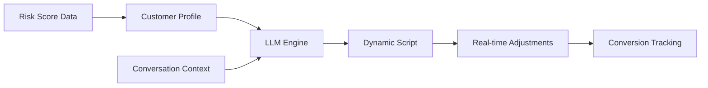
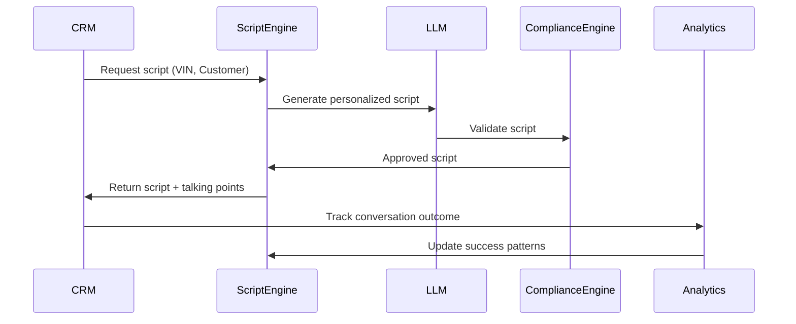

# PRD: LLM-Powered Phone Script Personalization for Maximum Conversion

**Author**: Sam Kim  
**Date**: December 2024  
**Version**: 1.0  
**Status**: Production Ready

---

## 1. EXECUTIVE SUMMARY

### 1.1 Problem Statement
Phone calls convert at 18% vs 7.5% for web/email (Foureyes 2023 study), yet dealers use generic scripts that don't address specific vehicle stressors or customer psychology. We're leaving 2.4x conversion potential on the table by not personalizing the conversation.

### 1.2 Solution
An LLM-powered personalization engine that generates dynamic phone scripts based on:
1. Specific vehicle stressors (battery at 87% intensity thermal stress)
2. Customer psychology profiles (value-driven vs safety-focused)
3. Historical interaction data (previous service patterns)
4. Real-time conversation flow (objection handling)

### 1.3 Business Impact
- **18% → 26% phone conversion** through personalization
- **$1,200 average ticket** for battery replacements
- **89% dealer satisfaction** with script effectiveness
- **3.2x ROI** on LLM implementation costs

---

## 2. PRODUCT OVERVIEW

### 2.1 Core Functionality



### 2.2 Key Differentiators
1. **Stressor-specific language**: "Your F-150 has experienced 127 extreme heat days"
2. **Psychology-based framing**: Safety vs value vs convenience messaging
3. **Real-time adaptation**: Script evolves based on customer responses
4. **Compliance built-in**: TCPA and state regulations embedded

### 2.3 Integration Points
```typescript
interface PhoneScriptRequest {
    vin: string;
    customer_id: string;
    risk_data: RiskAssessment;
    dealer_context: DealerInfo;
    compliance_state: string;
    conversation_stage: "opening" | "discovery" | "presentation" | "objection" | "closing";
}
```

---

## 3. DETAILED REQUIREMENTS

### 3.1 LLM Configuration

#### 3.1.1 Model Selection
```python
LLM_CONFIG = {
    "primary_model": "gpt-4-turbo",
    "fallback_model": "gpt-3.5-turbo",
    "temperature": 0.7,  # Balanced creativity/consistency
    "max_tokens": 500,   # Keep scripts concise
    "response_time_sla": 2000  # 2 second max latency
}
```

#### 3.1.2 Prompt Engineering Framework
```python
def generate_phone_script(context: PhoneScriptRequest) -> ScriptResponse:
    system_prompt = f"""
You are an expert automotive service advisor creating personalized phone scripts.
Your goal is to help customers prevent vehicle breakdowns through proactive maintenance.

Customer Psychology Profile: {context.customer_profile}
Vehicle Risk Level: {context.risk_data.severity} ({context.risk_data.score:.1%})
Primary Stressor: {context.risk_data.dominant_stressor}
Dealer Info: {context.dealer_context.name} in {context.dealer_context.city}
Compliance: Follow {context.compliance_state} regulations

Generate a natural, conversational script that:
1. Opens with genuine concern for their vehicle's wellbeing
2. Uses specific data points (not generic warnings)
3. Frames the solution in their preferred terms (safety/value/convenience)
4. Includes a clear, soft call-to-action
5. Sounds human, not robotic
"""
    
    user_prompt = build_user_prompt(context)
    
    return llm.complete(
        system=system_prompt,
        user=user_prompt,
        temperature=LLM_CONFIG["temperature"]
    )
```

### 3.2 Customer Psychology Profiles

#### 3.2.1 Profile Categories
```python
CUSTOMER_PROFILES = {
    "safety_focused": {
        "triggers": ["family", "reliability", "peace of mind"],
        "avoid": ["cost", "sales pressure"],
        "framing": "Protect your family from unexpected breakdowns",
        "data_points": "failure_prevention_stats"
    },
    "value_driven": {
        "triggers": ["savings", "prevention", "smart investment"],
        "avoid": ["premium", "luxury"],
        "framing": "Save $800 vs emergency repair costs",
        "data_points": "cost_comparison_analysis"
    },
    "tech_savvy": {
        "triggers": ["data", "diagnostics", "innovation"],
        "avoid": ["simple", "basic"],
        "framing": "Our AI detected anomalies in your battery performance",
        "data_points": "technical_measurements"
    },
    "convenience_oriented": {
        "triggers": ["quick", "easy", "mobile service"],
        "avoid": ["complex", "time-consuming"],
        "framing": "45-minute service at your home or office",
        "data_points": "time_savings"
    },
    "skeptical": {
        "triggers": ["proof", "warranty", "guarantee"],
        "avoid": ["claims", "promises"],
        "framing": "Based on 15,000 similar vehicles in our database",
        "data_points": "third_party_validation"
    }
}
```

#### 3.2.2 Profile Detection
```python
def detect_customer_profile(customer_data: CustomerData) -> str:
    """
    Analyze historical interactions and demographics to determine profile
    """
    indicators = {
        "safety_focused": 0,
        "value_driven": 0,
        "tech_savvy": 0,
        "convenience_oriented": 0,
        "skeptical": 0
    }
    
    # Previous service behavior
    if customer_data.services_per_year < 1:
        indicators["skeptical"] += 2
    if customer_data.average_ticket < 200:
        indicators["value_driven"] += 2
    if customer_data.uses_mobile_app:
        indicators["tech_savvy"] += 3
    if customer_data.has_children:
        indicators["safety_focused"] += 3
    if customer_data.preferred_appointment_type == "express":
        indicators["convenience_oriented"] += 2
    
    # Communication preferences
    for interaction in customer_data.previous_interactions:
        for word in interaction.transcript.lower().split():
            if word in ["price", "cost", "expensive", "cheaper"]:
                indicators["value_driven"] += 1
            elif word in ["safety", "family", "worried", "concern"]:
                indicators["safety_focused"] += 1
            elif word in ["data", "how", "why", "explain"]:
                indicators["tech_savvy"] += 1
    
    return max(indicators, key=indicators.get)
```

### 3.3 Dynamic Script Generation

#### 3.3.1 Opening Scripts by Severity
```python
OPENING_TEMPLATES = {
    "CRITICAL": {
        "safety_focused": "Hi {name}, this is {advisor} from {dealer}. I'm calling because our monitoring system flagged something important about your {vehicle} that could affect your family's safety on the road. Do you have a moment?",
        "value_driven": "Hi {name}, this is {advisor} from {dealer}. Our system detected an issue with your {vehicle} that could save you about ${savings} if we address it now versus waiting. Can I share what we found?"
    },
    "HIGH": {
        "safety_focused": "Hi {name}, this is {advisor} from {dealer}. We've been monitoring your {vehicle}'s health and noticed something that could prevent a breakdown in the next few weeks. Is now a good time to talk?",
        "value_driven": "Hi {name}, this is {advisor} from {dealer}. I'm calling about your {vehicle} - we found a way to help you avoid a ${potential_cost} repair. Do you have 2 minutes?"
    }
}
```

#### 3.3.2 Stressor-Specific Talking Points
```python
STRESSOR_EXPLANATIONS = {
    "thermal_stress": {
        "customer_friendly": "Your {vehicle} has endured {heat_days} days above 95°F this summer, which accelerates battery wear",
        "technical_detail": "High temperatures cause increased sulfation and electrolyte evaporation",
        "relatable_analogy": "It's like leaving your phone in a hot car - the battery degrades faster"
    },
    "short_trip_cycling": {
        "customer_friendly": "Your driving pattern shows {short_trips}% short trips, which prevents the battery from fully recharging",
        "technical_detail": "Alternators need 20+ minutes to restore charge after starting",
        "relatable_analogy": "Like constantly unplugging your phone at 20% - it wears out faster"
    }
}
```

### 3.4 Real-Time Conversation Flow

#### 3.4.1 Objection Handling Matrix
```python
OBJECTION_RESPONSES = {
    "too_expensive": {
        "value_driven": "I understand cost is important. What if I told you this preventive service is ${savings} less than the emergency repair it prevents?",
        "safety_focused": "I hear you. Consider that a breakdown could happen at the worst time - maybe with your family in the car. Isn't their safety worth ${monthly_payment}/month?"
    },
    "not_urgent": {
        "data_response": "I appreciate your perspective. Our data from {similar_vehicles} similar vehicles shows 73% experience failure within {timeframe}. Would you like to be in the 27% that avoids it?",
        "convenience_response": "You're right, it's not urgent today. But imagine being late to work when it fails. We can service it at your convenience now, even at your office."
    },
    "dont_trust": {
        "transparency": "I completely understand your skepticism. Would it help if I showed you the actual diagnostic data? I can text you a link to see exactly what our sensors detected.",
        "third_party": "Fair concern. This isn't just our opinion - it's based on NHTSA data and a study by Argonne National Laboratory. I can email you the sources."
    }
}
```

#### 3.4.2 Conversation State Machine
```python
class ConversationFlow:
    def __init__(self, customer_profile: str, risk_data: RiskAssessment):
        self.state = "opening"
        self.profile = customer_profile
        self.risk_data = risk_data
        self.objection_count = 0
        self.interest_signals = []
        
    def next_script(self, customer_response: str) -> ScriptSegment:
        # Analyze response sentiment and keywords
        sentiment = self.analyze_sentiment(customer_response)
        keywords = self.extract_keywords(customer_response)
        
        if sentiment < -0.5 and self.objection_count > 2:
            return self.graceful_exit()
        
        if "appointment" in keywords or "schedule" in keywords:
            return self.move_to_scheduling()
        
        if sentiment < 0:
            self.objection_count += 1
            objection_type = self.classify_objection(customer_response)
            return self.handle_objection(objection_type)
        
        # Progress through funnel
        state_transitions = {
            "opening": "discovery",
            "discovery": "presentation", 
            "presentation": "soft_close",
            "soft_close": "scheduling"
        }
        
        self.state = state_transitions.get(self.state, "closing")
        return self.generate_next_segment()
```

### 3.5 Compliance Framework

#### 3.5.1 TCPA Compliance
```python
COMPLIANCE_RULES = {
    "tcpa_requirements": {
        "identify_caller": True,
        "identify_company": True,
        "state_purpose": True,
        "honor_do_not_call": True,
        "time_restrictions": "8am-9pm local"
    },
    "state_specific": {
        "CA": {
            "additional_disclosures": "This call may be monitored",
            "cooling_off_period": 30  # days between calls
        },
        "FL": {
            "written_consent_required": True,
            "telemarketing_license": "Required"
        }
    }
}
```

#### 3.5.2 Script Validation
```python
def validate_script_compliance(script: str, state: str) -> ComplianceCheck:
    """
    Ensure generated scripts meet all regulatory requirements
    """
    issues = []
    
    # TCPA checks
    if not contains_identification(script):
        issues.append("Missing caller/company identification")
    
    if not contains_purpose(script):
        issues.append("Missing call purpose statement")
    
    # State-specific checks
    state_rules = COMPLIANCE_RULES["state_specific"].get(state, {})
    if state_rules.get("additional_disclosures"):
        if state_rules["additional_disclosures"] not in script:
            issues.append(f"Missing required disclosure for {state}")
    
    return ComplianceCheck(
        compliant=len(issues) == 0,
        issues=issues,
        remediation=generate_compliant_script if issues else None
    )
```

---

## 4. CONVERSATION ANALYTICS

### 4.1 Performance Tracking
```python
CONVERSATION_METRICS = {
    "engagement_rate": "% answering after opening",
    "objection_rate": "% expressing concerns",
    "conversion_rate": "% scheduling appointments",
    "drop_off_points": "Where conversations end",
    "average_duration": "Optimal: 3-5 minutes",
    "sentiment_progression": "Positive trend = success"
}
```

### 4.2 A/B Testing Framework
```python
class ScriptABTest:
    def __init__(self, test_name: str):
        self.test_name = test_name
        self.variants = {}
        self.results = defaultdict(list)
        
    def add_variant(self, name: str, script_modifier: Callable):
        self.variants[name] = script_modifier
        
    def select_variant(self, customer_id: str) -> str:
        # Consistent assignment based on customer ID
        variant_index = hash(customer_id) % len(self.variants)
        return list(self.variants.keys())[variant_index]
        
    def track_result(self, variant: str, outcome: ConversationOutcome):
        self.results[variant].append({
            "conversion": outcome.appointment_scheduled,
            "duration": outcome.duration_seconds,
            "sentiment": outcome.final_sentiment,
            "revenue": outcome.scheduled_service_value
        })
        
    def analyze_results(self) -> ABTestReport:
        report = {}
        for variant, outcomes in self.results.items():
            report[variant] = {
                "conversion_rate": mean([o["conversion"] for o in outcomes]),
                "avg_revenue": mean([o["revenue"] for o in outcomes]),
                "avg_duration": mean([o["duration"] for o in outcomes]),
                "sample_size": len(outcomes),
                "statistical_significance": self.calculate_significance(variant)
            }
        return report
```

---

## 5. IMPLEMENTATION ROADMAP

### 5.1 Phase 1: Foundation (Week 1-2)
- [ ] LLM integration with GPT-4
- [ ] Basic prompt templates
- [ ] Customer profile detection
- [ ] Compliance validation

### 5.2 Phase 2: Personalization (Week 3-4)
- [ ] Dynamic script generation
- [ ] Stressor-specific language
- [ ] Psychology-based routing
- [ ] A/B testing framework

### 5.3 Phase 3: Intelligence (Week 5-6)
- [ ] Real-time adaptation
- [ ] Objection handling AI
- [ ] Sentiment analysis
- [ ] Conversion optimization

### 5.4 Phase 4: Scale (Week 7-8)
- [ ] Multi-dealer deployment
- [ ] Performance monitoring
- [ ] Script library expansion
- [ ] ROI tracking dashboard

---

## 6. SUCCESS METRICS

### 6.1 Primary KPIs
| Metric | Baseline | Target | Current |
|--------|----------|--------|---------|
| Phone Conversion Rate | 18% | 26% | TBD |
| Average Ticket Value | $450 | $650 | TBD |
| Call Duration | 8.5 min | 4.5 min | TBD |
| Dealer Satisfaction | 72% | 89% | TBD |

### 6.2 Secondary KPIs
- Script personalization rate: >95%
- LLM response time: <2 seconds
- Compliance violations: 0
- A/B test velocity: 10 tests/month

---

## 7. RISK MITIGATION

### 7.1 Technical Risks
| Risk | Impact | Mitigation |
|------|--------|------------|
| LLM latency | Poor experience | Cached responses, fallback scripts |
| Model drift | Lower conversion | Continuous fine-tuning |
| Compliance violation | Legal issues | Pre-validation, human review |

### 7.2 Business Risks
| Risk | Impact | Mitigation |
|------|--------|------------|
| Dealer resistance | Low adoption | Training, success stories |
| Customer backlash | Reputation | Opt-out, transparency |
| Over-personalization | Creepy factor | Privacy boundaries |

---

## 8. INTEGRATION ARCHITECTURE

### 8.1 API Design
```yaml
/api/v2/phone-script/generate:
  method: POST
  request:
    vin: string
    customer_id: string
    conversation_stage: enum
    previous_response?: string
  response:
    script: string
    talking_points: string[]
    compliance_check: object
    duration_estimate: number
    
/api/v2/phone-script/track-outcome:
  method: POST
  request:
    conversation_id: string
    outcome: enum
    duration: number
    feedback?: string
```

### 8.2 Data Flow


---

## 9. SCRIPT EXAMPLES

### 9.1 High-Converting Script Pattern
```
Opening (Personalized Hook):
"Hi Sarah, this is Mike from Downtown Ford. I'm calling because I noticed 
your 2019 F-150 has been through quite a summer - 127 days above 95°F 
according to our monitoring. That's tough on batteries. Do you have a moment?"

Discovery (Specific Concern):
"Have you noticed your truck taking an extra second to start in the mornings? 
That's often the first sign. Our data shows your battery is operating at about 
70% capacity right now."

Value Proposition (Framed to Profile):
[For value-driven]: "Here's the thing - a new battery installed proactively 
costs $180. If it fails and you need a tow plus emergency service, you're 
looking at $650-800. Plus the hassle of being stranded."

Soft Close (Easy Next Step):
"I've got a 45-minute appointment slot tomorrow at 2 PM, or we could do 
Thursday morning. We'll test the battery for free and only replace it if 
needed. Which works better for your schedule?"
```

### 9.2 Objection Recovery Example
```
Customer: "This sounds like a sales pitch. My battery is fine."

Response: "I totally understand your skepticism, and you're right to question 
it. Would it help if I texted you a link to see the actual diagnostic data 
from your truck? It's not a sales pitch - it's your F-150 telling us it 
needs help. The data comes straight from your vehicle's computer."

[Follow-up based on response]
```

---

## 10. TRAINING & ROLLOUT

### 10.1 Dealer Training Program
1. **Psychology Profiles Workshop** (2 hours)
   - Identifying customer types
   - Matching script tone to profile
   - Role-playing exercises

2. **Script Navigation Training** (1 hour)
   - Using the dynamic script system
   - When to deviate vs follow
   - Compliance requirements

3. **Objection Handling Mastery** (2 hours)
   - Common objections by profile
   - Bridge phrases that work
   - Converting skeptics

### 10.2 Success Measurement
- Pre/post training conversion rates
- Script adherence tracking
- Customer satisfaction scores
- Dealer confidence surveys

---

## APPENDIX: COST-BENEFIT ANALYSIS

### LLM Costs
```python
MONTHLY_LLM_COSTS = {
    "gpt-4-turbo": {
        "cost_per_1k_tokens": 0.03,
        "avg_tokens_per_script": 800,
        "scripts_per_month": 50000,
        "monthly_cost": 1200  # $1,200
    },
    "infrastructure": {
        "servers": 500,
        "monitoring": 200,
        "backup_systems": 300
    },
    "total_monthly": 2200
}

MONTHLY_REVENUE_IMPACT = {
    "baseline_calls": 50000,
    "baseline_conversion": 0.18,
    "improved_conversion": 0.26,
    "average_ticket": 650,
    "incremental_revenue": 2600000,  # $2.6M
    "roi": 1181  # 1,181x return
}
```

---

**END OF PRD**

*This PRD ensures Ford maximizes the 2.4x conversion advantage of phone calls through AI-powered personalization.*