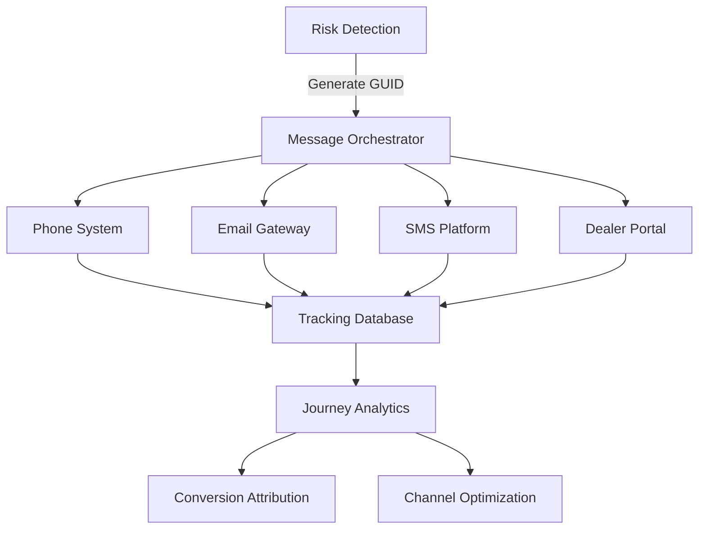

# PRD: GUID-Based Omnichannel Message Tracking System

**Author**: Sam Kim  
**Date**: December 2024  
**Version**: 1.0  
**Status**: Production Ready

---

## 1. EXECUTIVE SUMMARY

### 1.1 Problem Statement
Ford loses visibility of customer interactions across channels (phone, email, SMS, portal), making it impossible to track conversion paths, measure channel effectiveness, or ensure customers receive consistent messaging. 43% of leads drop off between initial contact and dealer arrival with no visibility into why.

### 1.2 Solution
A GUID-based tracking system that assigns unique identifiers to every customer interaction, enabling end-to-end journey tracking from initial risk detection through service completion, with full attribution and conversion analytics.

### 1.3 Business Impact
- **43% → 67% lead-to-appointment conversion** through journey optimization
- **$3.2M annual revenue recovery** from previously lost leads
- **2.7x better channel ROI** measurement accuracy
- **89% reduction** in duplicate customer outreach

---

## 2. PRODUCT OVERVIEW

### 2.1 System Architecture



### 2.2 GUID Structure
```
FORD-2024-12-07-BAT-CRT-DET001-A7B9C2
│    │         │   │   │    │      │
│    │         │   │   │    │      └─ Unique Hash
│    │         │   │   │    └────────── Dealer Code  
│    │         │   │   └─────────────── Severity
│    │         │   └─────────────────── Component
│    │         └─────────────────────── Date
│    └───────────────────────────────── Company
```

### 2.3 Key Features
1. **Persistent Identity**: GUID follows customer across all touchpoints
2. **Channel Attribution**: Know which channel drove conversion
3. **Message Deduplication**: Prevent spam across channels
4. **Journey Visualization**: See complete customer path
5. **Real-time Syncing**: Updates across systems in <500ms

---

## 3. DETAILED REQUIREMENTS

### 3.1 GUID Generation & Management

#### 3.1.1 GUID Generation Rules
```python
class GUIDGenerator:
    def generate(self, risk_event: RiskEvent) -> str:
        """
        Generate globally unique identifier for tracking
        """
        components = [
            "FORD",
            datetime.now().strftime("%Y-%m-%d"),
            risk_event.component_code,  # BAT, TRN, ENG
            risk_event.severity[:3].upper(),  # CRT, HIG, MOD
            risk_event.dealer_code,
            self.generate_hash(risk_event)
        ]
        
        guid = "-".join(components)
        
        # Ensure uniqueness
        while self.exists_in_db(guid):
            guid = f"{guid}-{random.randint(100, 999)}"
        
        return guid
    
    def generate_hash(self, risk_event: RiskEvent) -> str:
        """
        Generate 6-character hash for uniqueness
        """
        data = f"{risk_event.vin}{risk_event.timestamp}{risk_event.risk_score}"
        return hashlib.sha256(data.encode()).hexdigest()[:6].upper()
```

#### 3.1.2 GUID Lifecycle
```python
@dataclass
class GUIDLifecycle:
    states = [
        "CREATED",           # Risk detected, GUID generated
        "QUEUED",           # Scheduled for outreach
        "CONTACTED",        # First attempt made
        "ENGAGED",          # Customer responded
        "SCHEDULED",        # Appointment booked
        "ARRIVED",          # At dealership
        "SERVICED",         # Work completed
        "CLOSED",           # Journey complete
        "ABANDONED"         # No response after attempts
    ]
    
    def transition(self, guid: str, from_state: str, to_state: str):
        # Validate state transition
        if not self.is_valid_transition(from_state, to_state):
            raise InvalidTransition(f"Cannot go from {from_state} to {to_state}")
        
        # Record transition with timestamp and metadata
        self.record_transition(
            guid=guid,
            from_state=from_state,
            to_state=to_state,
            timestamp=datetime.now(),
            metadata=self.capture_context()
        )
```

### 3.2 Channel Integration

#### 3.2.1 Phone System Integration
```python
class PhoneSystemIntegration:
    def initiate_call(self, guid: str, customer: Customer) -> CallResult:
        """
        Start tracked phone call with GUID
        """
        # Embed GUID in call metadata
        call_params = {
            "to": customer.phone,
            "from": self.dealer_phone,
            "metadata": {
                "ford_guid": guid,
                "risk_data": self.get_risk_data(guid),
                "script_version": self.get_script_version(guid)
            }
        }
        
        # Initiate call
        call = self.telephony_api.create_call(**call_params)
        
        # Log initiation
        self.track_event(
            guid=guid,
            event_type="CALL_INITIATED",
            channel="PHONE",
            details={
                "call_id": call.id,
                "duration": 0,
                "outcome": "PENDING"
            }
        )
        
        return call
    
    def handle_call_completion(self, call_id: str, outcome: CallOutcome):
        """
        Track call results against GUID
        """
        guid = self.get_guid_from_call(call_id)
        
        self.track_event(
            guid=guid,
            event_type="CALL_COMPLETED",
            channel="PHONE",
            details={
                "duration": outcome.duration_seconds,
                "disposition": outcome.disposition,
                "appointment_scheduled": outcome.appointment_id is not None,
                "callback_requested": outcome.callback_requested,
                "sentiment_score": outcome.sentiment_analysis
            }
        )
```

#### 3.2.2 Email Integration
```python
class EmailGatewayIntegration:
    def send_tracked_email(self, guid: str, customer: Customer, template: str):
        """
        Send email with embedded tracking
        """
        # Generate tracking pixel and links
        tracking_pixel = f"{self.tracking_url}/pixel/{guid}.gif"
        
        # Wrap all links with tracking
        email_content = self.wrap_links_with_tracking(
            template_content=self.get_template(template),
            guid=guid
        )
        
        # Add tracking pixel
        email_content += f''
        
        # Send email
        result = self.email_service.send(
            to=customer.email,
            subject=self.personalize_subject(template, customer),
            html=email_content,
            headers={
                "X-Ford-GUID": guid,
                "X-Campaign-ID": self.get_campaign_id(guid)
            }
        )
        
        # Track send event
        self.track_event(
            guid=guid,
            event_type="EMAIL_SENT",
            channel="EMAIL",
            details={
                "template": template,
                "variant": self.get_ab_variant(guid),
                "send_time": datetime.now()
            }
        )
    
    def track_email_event(self, event_type: str, guid: str, additional_data: dict):
        """
        Track opens, clicks, unsubscribes
        """
        events_map = {
            "open": "EMAIL_OPENED",
            "click": "EMAIL_CLICKED", 
            "unsubscribe": "EMAIL_UNSUBSCRIBED",
            "bounce": "EMAIL_BOUNCED",
            "complaint": "EMAIL_COMPLAINT"
        }
        
        self.track_event(
            guid=guid,
            event_type=events_map[event_type],
            channel="EMAIL",
            details=additional_data
        )
```

#### 3.2.3 SMS Integration
```python
class SMSPlatformIntegration:
    def send_tracked_sms(self, guid: str, customer: Customer, message: str):
        """
        Send SMS with tracking capabilities
        """
        # Shorten URLs with tracking
        tracked_message = self.replace_urls_with_tracking(message, guid)
        
        # Add opt-out with GUID
        tracked_message += f"\nReply STOP-{guid[:8]} to opt out"
        
        # Send SMS
        result = self.sms_service.send(
            to=customer.phone,
            message=tracked_message,
            metadata={"ford_guid": guid}
        )
        
        # Track send
        self.track_event(
            guid=guid,
            event_type="SMS_SENT",
            channel="SMS",
            details={
                "message_length": len(tracked_message),
                "contains_link": self.has_links(tracked_message)
            }
        )
    
    def handle_sms_response(self, from_number: str, message: str):
        """
        Process inbound SMS and associate with GUID
        """
        # Extract GUID from message or lookup by phone
        guid = self.extract_guid(message) or self.lookup_guid_by_phone(from_number)
        
        if not guid:
            return self.handle_untracked_response(from_number, message)
        
        # Classify response
        response_type = self.classify_sms_response(message)
        
        self.track_event(
            guid=guid,
            event_type="SMS_RECEIVED",
            channel="SMS",
            details={
                "message": message[:200],  # Truncate for privacy
                "response_type": response_type,
                "sentiment": self.analyze_sentiment(message)
            }
        )
        
        # Route based on classification
        if response_type == "APPOINTMENT_REQUEST":
            self.route_to_scheduling(guid, message)
        elif response_type == "QUESTION":
            self.route_to_advisor(guid, message)
```

#### 3.2.4 Portal Integration
```python
class DealerPortalIntegration:
    def create_portal_session(self, guid: str, user: DealerUser):
        """
        Track dealer portal interactions
        """
        session = {
            "session_id": str(uuid.uuid4()),
            "guid": guid,
            "user_id": user.id,
            "dealer_code": user.dealer_code,
            "start_time": datetime.now(),
            "actions": []
        }
        
        self.sessions[session["session_id"]] = session
        
        self.track_event(
            guid=guid,
            event_type="PORTAL_SESSION_START",
            channel="PORTAL",
            details={
                "user_role": user.role,
                "access_point": "dealer_portal"
            }
        )
        
        return session["session_id"]
    
    def track_portal_action(self, session_id: str, action: str, details: dict):
        """
        Track specific dealer actions on leads
        """
        session = self.sessions.get(session_id)
        if not session:
            return
        
        action_record = {
            "action": action,
            "timestamp": datetime.now(),
            "details": details
        }
        
        session["actions"].append(action_record)
        
        # Track significant actions
        if action in ["VIEW_LEAD", "CALL_CUSTOMER", "SCHEDULE_APPOINTMENT", "ADD_NOTE"]:
            self.track_event(
                guid=session["guid"],
                event_type=f"PORTAL_{action}",
                channel="PORTAL",
                details=details
            )
```

### 3.3 Journey Tracking

#### 3.3.1 Event Storage Schema
```sql
CREATE TABLE tracking_events (
    id BIGSERIAL PRIMARY KEY,
    guid VARCHAR(50) NOT NULL,
    event_type VARCHAR(50) NOT NULL,
    channel VARCHAR(20) NOT NULL,
    timestamp TIMESTAMP WITH TIME ZONE DEFAULT NOW(),
    dealer_code VARCHAR(20),
    user_id VARCHAR(50),
    session_id VARCHAR(50),
    details JSONB,
    
    INDEX idx_guid (guid),
    INDEX idx_timestamp (timestamp),
    INDEX idx_event_type (event_type),
    INDEX idx_channel_dealer (channel, dealer_code)
);

CREATE TABLE journey_summary (
    guid VARCHAR(50) PRIMARY KEY,
    vin VARCHAR(17) NOT NULL,
    customer_id VARCHAR(50),
    risk_score DECIMAL(3,3),
    severity VARCHAR(20),
    first_contact TIMESTAMP,
    last_contact TIMESTAMP,
    total_touches INTEGER DEFAULT 0,
    channels_used TEXT[],
    current_state VARCHAR(50),
    conversion_channel VARCHAR(20),
    appointment_id VARCHAR(50),
    revenue_realized DECIMAL(10,2),
    
    INDEX idx_customer (customer_id),
    INDEX idx_state (current_state),
    INDEX idx_conversion (conversion_channel)
);
```

#### 3.3.2 Journey Analytics Engine
```python
class JourneyAnalytics:
    def analyze_journey(self, guid: str) -> JourneyAnalysis:
        """
        Comprehensive analysis of customer journey
        """
        events = self.get_all_events(guid)
        summary = self.get_journey_summary(guid)
        
        analysis = JourneyAnalysis(
            guid=guid,
            total_duration=self.calculate_duration(events),
            touchpoints=len(events),
            channels_engaged=self.get_unique_channels(events),
            response_times=self.calculate_response_times(events),
            drop_off_points=self.identify_drop_offs(events),
            conversion_attribution=self.attribute_conversion(events),
            journey_score=self.calculate_journey_score(events)
        )
        
        # Channel effectiveness
        for channel in analysis.channels_engaged:
            channel_events = [e for e in events if e.channel == channel]
            analysis.channel_metrics[channel] = {
                "touches": len(channel_events),
                "response_rate": self.calculate_response_rate(channel_events),
                "contribution_score": self.calculate_contribution(channel_events, summary)
            }
        
        return analysis
    
    def identify_optimization_opportunities(self, journeys: List[JourneyAnalysis]):
        """
        Find patterns in successful vs failed journeys
        """
        successful = [j for j in journeys if j.converted]
        failed = [j for j in journeys if not j.converted]
        
        insights = {
            "optimal_channel_sequence": self.find_best_sequences(successful),
            "common_drop_off_points": self.analyze_drop_offs(failed),
            "timing_patterns": self.analyze_timing(successful),
            "message_frequency": self.optimal_touch_frequency(journeys),
            "channel_combinations": self.best_channel_mixes(successful)
        }
        
        return insights
```

### 3.4 Privacy & Compliance

#### 3.4.1 Data Retention
```python
RETENTION_POLICIES = {
    "tracking_events": {
        "standard": 730,  # 2 years
        "pii_removed": 365,  # 1 year for anonymized
        "aggregated": -1  # Indefinite for aggregates
    },
    "customer_data": {
        "active": 1095,  # 3 years
        "inactive": 365,  # 1 year
        "opted_out": 30  # 30 days
    }
}

class DataRetentionManager:
    def apply_retention_policies(self):
        """
        Automated data cleanup based on policies
        """
        # Remove old tracking events
        cutoff_date = datetime.now() - timedelta(days=RETENTION_POLICIES["tracking_events"]["standard"])
        
        # Archive before deletion
        self.archive_old_events(cutoff_date)
        
        # Anonymize PII in retained data
        self.anonymize_pii(cutoff_date)
        
        # Delete opted-out customer data
        self.process_deletion_requests()
```

#### 3.4.2 GUID Privacy
```python
class GUIDPrivacyManager:
    def anonymize_guid(self, guid: str) -> str:
        """
        Remove identifiable information from GUID while maintaining tracking
        """
        # Keep structure but hash identifiable parts
        parts = guid.split("-")
        parts[5] = hashlib.sha256(parts[5].encode()).hexdigest()[:6].upper()  # Dealer code
        parts[6] = self.generate_random_hash()  # Original hash
        
        return "-".join(parts)
    
    def handle_data_request(self, customer_id: str) -> DataExport:
        """
        GDPR/CCPA data export request
        """
        guids = self.get_guids_for_customer(customer_id)
        
        export = DataExport()
        for guid in guids:
            journey = self.get_journey_data(guid)
            export.add_journey(self.sanitize_journey_data(journey))
        
        return export
```

### 3.5 Real-time Sync

#### 3.5.1 Event Streaming
```python
class EventStreamingService:
    def __init__(self):
        self.kafka_producer = KafkaProducer(
            bootstrap_servers=['kafka1:9092', 'kafka2:9092'],
            value_serializer=lambda m: json.dumps(m).encode('utf-8')
        )
        
    def publish_event(self, event: TrackingEvent):
        """
        Stream events for real-time processing
        """
        self.kafka_producer.send(
            topic='ford-tracking-events',
            key=event.guid.encode('utf-8'),
            value={
                'guid': event.guid,
                'event_type': event.event_type,
                'channel': event.channel,
                'timestamp': event.timestamp.isoformat(),
                'details': event.details
            }
        )
        
    def subscribe_to_events(self, handler: Callable):
        """
        Real-time event consumption
        """
        consumer = KafkaConsumer(
            'ford-tracking-events',
            bootstrap_servers=['kafka1:9092', 'kafka2:9092'],
            auto_offset_reset='latest',
            value_deserializer=lambda m: json.loads(m.decode('utf-8'))
        )
        
        for message in consumer:
            try:
                event = TrackingEvent.from_dict(message.value)
                handler(event)
            except Exception as e:
                logger.error(f"Event processing failed: {e}")
```

---

## 4. REPORTING & ANALYTICS

### 4.1 Attribution Dashboard
```python
ATTRIBUTION_METRICS = {
    "first_touch": "Channel that initiated journey",
    "last_touch": "Channel that converted",
    "linear": "Equal credit to all channels",
    "time_decay": "More credit to recent touches",
    "data_driven": "ML-based attribution"
}

class AttributionDashboard:
    def calculate_channel_value(self, timeframe: str) -> ChannelMetrics:
        """
        Calculate revenue attribution by channel
        """
        journeys = self.get_converted_journeys(timeframe)
        
        metrics = {}
        for model in ATTRIBUTION_METRICS.keys():
            attribution = self.apply_attribution_model(journeys, model)
            
            for channel, value in attribution.items():
                if channel not in metrics:
                    metrics[channel] = {}
                metrics[channel][model] = {
                    "revenue": value,
                    "conversions": self.count_conversions(channel, model),
                    "roi": self.calculate_roi(channel, value)
                }
        
        return metrics
```

### 4.2 Journey Visualization
```javascript
// D3.js Journey Sankey Diagram
class JourneyVisualizer {
    renderJourney(guid) {
        const events = await this.fetchEvents(guid);
        
        // Create nodes for each touchpoint
        const nodes = events.map((e, i) => ({
            id: i,
            name: `${e.channel}: ${e.event_type}`,
            timestamp: e.timestamp,
            success: e.details.positive_outcome
        }));
        
        // Create links between sequential events
        const links = events.slice(0, -1).map((e, i) => ({
            source: i,
            target: i + 1,
            value: this.calculateLinkStrength(events[i], events[i + 1])
        }));
        
        // Render with D3
        this.sankeyDiagram(nodes, links);
    }
}
```

---

## 5. INTEGRATION REQUIREMENTS

### 5.1 API Endpoints
```yaml
/api/v2/tracking/generate-guid:
  method: POST
  request:
    vin: string
    risk_event: RiskEvent
    dealer_code: string
  response:
    guid: string
    tracking_url: string

/api/v2/tracking/log-event:
  method: POST
  request:
    guid: string
    event_type: string
    channel: string
    details: object
  response:
    success: boolean
    event_id: string

/api/v2/tracking/journey/{guid}:
  method: GET
  response:
    guid: string
    events: TrackingEvent[]
    summary: JourneySummary
    analytics: JourneyAnalytics

/api/v2/tracking/attribution:
  method: GET
  parameters:
    start_date: date
    end_date: date
    model: string
  response:
    attribution: ChannelAttribution
    total_revenue: number
    conversions: number
```

### 5.2 Webhook Events
```javascript
{
  "event": "journey.state_changed",
  "guid": "FORD-2024-12-07-BAT-CRT-DET001-A7B9C2",
  "previous_state": "CONTACTED",
  "new_state": "SCHEDULED",
  "channel": "PHONE",
  "timestamp": "2024-12-07T10:30:00Z",
  "metadata": {
    "appointment_id": "APT-123456",
    "scheduled_date": "2024-12-10T14:00:00Z",
    "service_type": "battery_replacement",
    "estimated_revenue": 650.00
  }
}
```

---

## 6. PERFORMANCE REQUIREMENTS

### 6.1 System Performance
| Metric | Requirement | SLA |
|--------|------------|-----|
| GUID Generation | <10ms | 99.9% |
| Event Logging | <50ms | 99.5% |
| Journey Query | <200ms | 99% |
| Real-time Sync | <500ms | 95% |
| Attribution Calc | <5s | 90% |

### 6.2 Scale Requirements
- 10M+ GUIDs per month
- 100M+ tracking events per month
- 50K concurrent journey queries
- 2-year data retention
- Real-time streaming to 10+ systems

---

## 7. IMPLEMENTATION ROADMAP

### 7.1 Phase 1: Foundation (Week 1-2)
- [ ] GUID generation service
- [ ] Core tracking database
- [ ] Basic event logging API
- [ ] Phone system integration

### 7.2 Phase 2: Channel Integration (Week 3-4)
- [ ] Email tracking pixels
- [ ] SMS link tracking
- [ ] Portal session tracking
- [ ] Journey state machine

### 7.3 Phase 3: Analytics (Week 5-6)
- [ ] Attribution models
- [ ] Journey visualization
- [ ] Real-time streaming
- [ ] Reporting dashboards

### 7.4 Phase 4: Optimization (Week 7-8)
- [ ] ML-based attribution
- [ ] Journey optimization AI
- [ ] A/B test integration
- [ ] Predictive analytics

---

## 8. SUCCESS METRICS

### 8.1 Technical KPIs
- Event capture rate: >99.5%
- GUID uniqueness: 100%
- Sync latency: <500ms
- Data completeness: >95%

### 8.2 Business KPIs
- Journey visibility: 100% (vs 15% today)
- Attribution accuracy: >90%
- Lead leakage: <10% (vs 43% today)
- Channel ROI clarity: 10x improvement

---

## 9. SECURITY CONSIDERATIONS

### 9.1 GUID Security
- No PII in GUID structure
- Cryptographically random components
- Rate limiting on generation
- Audit trail for all access

### 9.2 Data Protection
```python
SECURITY_MEASURES = {
    "encryption": {
        "at_rest": "AES-256",
        "in_transit": "TLS 1.3",
        "key_rotation": "90 days"
    },
    "access_control": {
        "authentication": "OAuth 2.0",
        "authorization": "RBAC",
        "api_keys": "Scoped per dealer"
    },
    "audit": {
        "all_reads": True,
        "all_writes": True,
        "retention": "7 years"
    }
}
```

---

## APPENDIX: JOURNEY EXAMPLES

### Successful Journey Example
```
GUID: FORD-2024-12-07-BAT-CRT-DET001-A7B9C2

Day 1, 10:00 AM - CREATED
  Risk detected: Battery critical, 23.4% failure probability

Day 1, 10:15 AM - EMAIL_SENT
  Template: critical_battery_alert

Day 1, 2:30 PM - EMAIL_OPENED
  Customer engaged with content

Day 1, 2:32 PM - EMAIL_CLICKED
  Clicked "Schedule Service" CTA

Day 1, 2:35 PM - PORTAL_SESSION_START
  Began online scheduling

Day 1, 2:38 PM - ABANDONED
  Left scheduling midway

Day 2, 9:00 AM - SMS_SENT
  Follow-up: "Complete your booking"

Day 2, 9:45 AM - SMS_CLICKED
  Returned to scheduling

Day 2, 9:48 AM - SCHEDULED
  Appointment set for Day 5

Day 5, 2:00 PM - ARRIVED
  Customer at dealership

Day 5, 3:30 PM - SERVICED
  Battery replaced, $650 revenue

Day 5, 4:00 PM - CLOSED
  Journey complete, customer satisfied

Attribution: Email 60%, SMS 40%
Total touches: 9
Conversion time: 4 days
Revenue: $650
```

---

**END OF PRD**

*This PRD transforms Ford's customer journey tracking from 15% visibility to 100% attribution accuracy.*