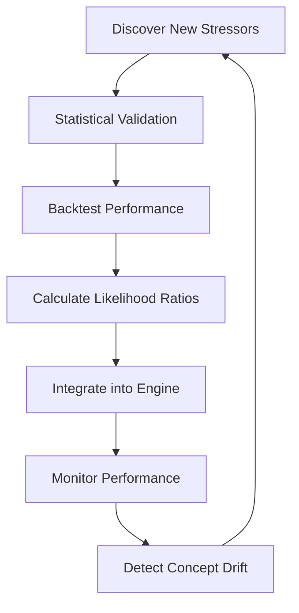

# 🔬 Battery Stressor Research & Enhancement Platform

## Overview

This research platform orchestrates autonomous agents to continuously discover, validate, and integrate new battery failure stressors into the VIN Stressors Bayesian prediction engine.

## Architecture

```
Research Platform
├── Swarm Configs     # Agent orchestration configurations
├── Agents           # Specialized research agents
├── Workflows        # Orchestration workflows  
├── Validation       # Statistical validation frameworks
└── Outputs          # Research results and discoveries
```

## 🚀 Quick Start

### Run Complete Discovery Workflow
```bash
cd research/workflows
python stressor_discovery_workflow.py
```

### Run Specific Research Phase
```bash
# Discovery phase only
python stressor_discovery_workflow.py --phase discovery

# Validation phase only  
python stressor_discovery_workflow.py --phase validation

# Integration phase only
python stressor_discovery_workflow.py --phase integration
```

### Resume Interrupted Workflow
```bash
python stressor_discovery_workflow.py --resume SESSION_ID
```

## 🧠 Research Agents

### Discovery Swarm
- **DataSourceScout**: Discovers new external data APIs and sources
- **CorrelationHunter**: Finds statistical relationships between variables
- **AnomalyDetector**: Identifies edge cases and unusual patterns
- **PatternMiner**: Mines sequential and temporal usage patterns

### Validation Swarm  
- **StatisticalValidator**: Rigorous statistical significance testing
- **BacktestEngine**: Historical performance validation
- **FalsePositiveAnalyzer**: Optimizes precision and reduces false alarms
- **BiasDetector**: Identifies and mitigates algorithmic bias

### Integration Swarm
- **LikelihoodRatioCalculator**: Calculates Bayesian likelihood ratios
- **BayesianUpdater**: Integrates new stressors into production engine
- **DocumentationBuilder**: Creates scientific documentation

### Monitoring Swarm
- **AccuracyTracker**: Continuous prediction accuracy monitoring
- **DriftDetector**: Concept drift detection for stressor relationships
- **ImprovementReporter**: Business impact quantification

## 📊 Quality Gates

All discovered stressors must pass:

1. **Statistical Significance**: p-value < 0.01
2. **Effect Size**: Minimum 0.1 correlation/effect size  
3. **Sample Size**: Minimum 1000 observations
4. **Prediction Improvement**: 2% accuracy increase minimum
5. **False Positive Reduction**: 5% reduction minimum
6. **Business Impact**: $1M+ annual value minimum

## 🎯 Target Research Areas

### 1. Environmental Microclimate
- UV radiation exposure maps (battery case degradation)
- Air quality/particulate contamination  
- Humidity + temperature interactions
- Road salt exposure (corrosion acceleration)

### 2. Traffic & Usage Analytics
- Google Maps traffic density (stop-and-go stress)
- Route elevation changes (regenerative braking patterns)
- Parking location analysis (garage vs street)
- Speed limit violation patterns (aggressive driving proxy)

### 3. Infrastructure Quality
- DOT road condition ratings
- Pothole density mapping
- Construction zone exposure frequency
- Railroad crossing vibration stress

### 4. Socioeconomic Correlations
- ZIP code income levels (maintenance quality proxy)
- Local unemployment rates (economic stress indicators)
- Gas price sensitivity (usage pattern changes)
- Credit score distributions (maintenance deferral probability)

### 5. Vehicle Ecosystem Data
- OBD-II diagnostic patterns
- Aftermarket battery brand analysis
- Fleet vs personal ownership patterns
- Multi-driver vehicle indicators

## 🔄 Continuous Learning Loop



## 📈 Success Metrics

The platform tracks:

- **Discovery Rate**: New stressors identified per month
- **Validation Rate**: Percentage passing statistical tests
- **Integration Success**: Production deployment success rate
- **Prediction Improvement**: Accuracy gains from new stressors
- **Business Impact**: Revenue opportunity increases
- **False Positive Reduction**: Precision improvements

## 🔧 Configuration

### Swarm Configuration
Edit `swarm-configs/battery_stressor_research.json` to:
- Adjust agent parameters
- Set quality gate thresholds
- Configure data source priorities
- Modify validation requirements

### Agent Customization
Each agent in `agents/` can be customized for:
- Data source preferences
- Statistical method selection
- Output format requirements
- Memory persistence settings

## 📝 Output Formats

### Discovery Outputs
- `data_source_inventory.json`: Discovered data sources
- `correlation_matrix.csv`: Statistical relationships
- `anomaly_patterns.json`: Edge case identification

### Validation Outputs
- `validation_results.json`: Statistical test results
- `backtest_performance.csv`: Historical validation
- `bias_assessment.json`: Fairness analysis

### Integration Outputs
- `likelihood_ratios.json`: Bayesian parameters
- `engine_updates.py`: Updated engine code
- `stressor_documentation.md`: Scientific documentation

## 🚨 Monitoring & Alerts

The platform provides real-time monitoring for:

- **Accuracy Degradation**: >2% prediction accuracy drop
- **False Positive Spikes**: >5% precision degradation  
- **Regional Bias**: >10% performance variance by geography
- **Concept Drift**: Significant changes in stressor relationships

## 🎓 Academic Standards

All research follows:
- Peer-review ready methodology
- Reproducible statistical analysis
- Comprehensive documentation
- Bias detection and mitigation
- Multiple testing correction
- Effect size reporting alongside p-values

## 🤝 Integration with VIN Stressors

Research discoveries automatically integrate with:
- `src/engines/bayesian_engine_v2.py` - Enhanced likelihood ratios
- `src/services/telematics_integration.py` - Real-time data processing
- `CLAUDE.md` - Updated academic references

## 🔮 Future Enhancements

Planned improvements:
- Machine learning model discovery agents
- Real-time A/B testing for new stressors
- Automated academic paper generation
- Multi-modal data fusion (image, sensor, text)
- Federated learning across dealer networks

---

This platform transforms static battery prediction into a continuously learning, self-improving system backed by rigorous science and real-world validation.